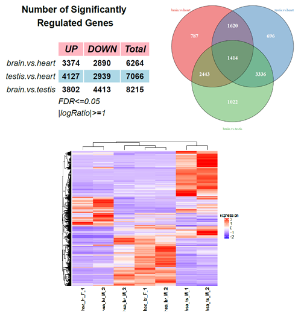
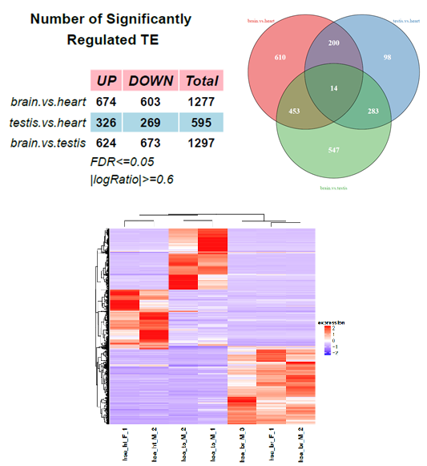
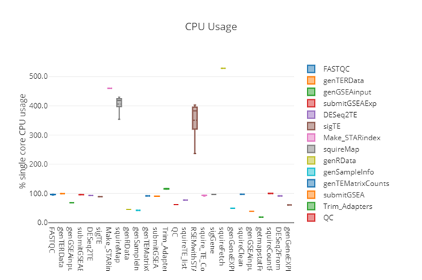

# GeneTEFlow: A Nextflow-based one-stop pipeline for differential expression analysis of genes and locus-specific transposable elements from RNA sequencing

## 1. Introduction

GeneTEFlow is a reproducible and platform-independent workflow for the comprehensive analysis of gene and locus-specific TEs expression from RNA-Seq data using Nextflow and Docker technologies.


## 2. Installation

### Section 1: Install docker and singularity (need &quot;root&quot; permission)
\
  **Step 1:**

  Installation of Docker on Ubuntu Linux system:

  **# apt-get install docker-ce**

  **# docker --version**

  Docker version 18.03.1-ce, build 9ee9f40

  **# which docker**

  /usr/bin/docker
  
\
  **Step 2:**

  Installation of Singularity on Ubuntu Linux system:

  **# apt-get install singularity-container**

  **# singularity --version**

  2.5.1-master.gd6e81547

  **# which singularity**

  /usr/local/bin/singularity
  

&nbsp;
&nbsp;


### Section 2: Getting GeneTEflow from github:

 **# git clone [https://github.com/zhongw2/GeneTEFlow](https://github.com/zhongw2/GeneTEFlow)**
 
&nbsp;
&nbsp;
 
### Section 3: Build images (need &quot;root&quot; permission)

  Using Dockerfile of GeneTEFlow.Process as an example:

  **# cd GeneTEFlow\_Dockerfiles/GeneTEFlow.Process/**

  **# docker build -t rnaseq\_pipeline.app .**

  Ref: [https://docs.docker.com/engine/reference/commandline/build/](https://docs.docker.com/engine/reference/commandline/build/)

&nbsp;

**Optional:**

If you need to run containers by Singularity, another step is required to convert docker images to Singularity images:

**# cd /mnt/**

**# docker run -v /var/run/docker.sock:/var/run/docker.sock -v /mnt:/output --privileged -t --rm singularityware/docker2singularity rnaseq\_pipeline.app**

Ref: [https://github.com/singularityware/docker2singularity](https://github.com/singularityware/docker2singularity)

The output file is a Singularity container under /mnt directory. For example, filename is &quot;rnaseq\_pipeline.app-2020-3-29-cf77fe9d8630.simg&quot;.

You may rename it, for example, to &quot;rnaseq\_pipeline.hpc.simg&quot; and run it on High Performance Computing (HPC) clusters by Singularity.

&nbsp;
&nbsp;

### Section 4: Testing containers

Testing the docker container:

**$ docker run rnaseq\_pipeline.app ls /RANSeq**

Ref: [https://docs.docker.com/engine/reference/commandline/run/](https://docs.docker.com/engine/reference/commandline/run/)

Testing the Singularity container:

**$ singularity exec rnaseq\_pipeline.hpc.simg ls /RANSeq**

Ref: [https://singularity.lbl.gov/docs-run](https://singularity.lbl.gov/docs-run)

&nbsp;
&nbsp;

### Section 5: install Nextflow
&nbsp;
**Optional:**

You might need to create a new user account for running nextflow. For instance, create a user account with name: &quot;geneteflow1&quot;:

**# useradd -m geneteflow1 -d /mnt/geneteflow1 -s /bin/bash**

**# passwd geneteflow1 ( geneteflow123 )**

&nbsp;

**Then:**

Login as user geneteflow1, and install Nextflow on Ubuntu Linux system:

**$ pwd**

/home/geneteflow1

**$ curl -s https://get.nextflow.io | bash**

**$ ./nextflow run hello**

Ref: [https://www.nextflow.io/](https://www.nextflow.io/)

&nbsp;
&nbsp;

## 3. Running GeneTEFlow

### Section 1: download reference genome and gtf files

Human reference genome UCSC hg38 with the gene annotation (.gtf) were downloaded from illumina iGenomes collections : [https://support.illumina.com/sequencing/sequencing\_software/igenome.html](https://support.illumina.com/sequencing/sequencing_software/igenome.html)

**$ wget http://igenomes.illumina.com.s3-website-us-east-1.amazonaws.com/Homo\_sapiens/UCSC/hg38/Homo\_sapiens\_UCSC\_hg38.tar.gz**

**$ tar xzvf Homo\_sapiens\_UCSC\_hg38.tar.gz**

**$ cp Homo\_sapiens/UCSC/hg38/Sequence/WholeGenomeFasta/genome.fa .**

**$ cp Homo\_sapiens/UCSC/hg38/Annotation/Genes/genes.gtf .**

&nbsp;
&nbsp;

### Section 2: collect all illumia raw data (.fastq.gz) into one folder

**$ mkdir RAW\_DATA/**

You may use &quot;ln -s&quot; command to create the soft links to the original locations of raw data.

Here human RNA sequencing data were downloaded through GEO accession number GSE30352, including brain, heart, and testis data with biological replicates.

| **Samples** | **GEO number** | **SRR number** |
| --- | --- | --- |
| Brain replicate 1 | GSM752691 | SRR306838 |
| Brain replicate 2 | GSM752694 | SRR306841 |
| Brain replicate 3 | GSM752692 | SRR306839 |
| Heart replicate 1 | GSM752699 | SRR306847 |
| Heart replicate 2 | GSM752701 | SRR306850 |
| Testis replicate 1 | GSM752707 | SRR306857 |
| Testis replicate 2 | GSM752708 | SRR306858 |

&nbsp;
**To build small testing data sets, first 1,000,000 reads in each sample was used here.**

**$zcat ~/original\_locations/hsa.br.F.1\_GSM752691\_R1.fastq.gz |head -n 4000000|gzip > RAW\_DATA/hsa.br.F.1\_GSM752691\_R1.fastq.gz**

&nbsp;
&nbsp;

### Section 3: modify the GeneTEFlow configuration file coordinately

### Parameters Configuration
These parameters below would be editable in the configuration file so that researchers could manually change these settings according to the type of their RNA-Seq. 


| **Name** | **Default value** | **Description** |
|:------------------|:----------------------------|:---------------------------|
|params.reads | `./RAW_DATA/*_R{1,2}.fastq.gz` | The input RAW Fastq files |
|params.adapter_trim_tag | `Y` | specify to run adapter trimming : "Y"(yes) or "N"(no) |
|params.DESeq_run_tag | `Y` | specify to run DESeq2 for differetial expression analysis : "Y"(yes) or "N"(no) |
|params.DESeq_replicates |  `Y` | specify to run DESeq2 with/without replicates: "Y"(with replicates) or "N"(without replicates)  |
|params.sampleinfoxlsx | `sampledetail.xlsx` | specify a EXCEL file that stored RNA-Seq samples information |
|params.sample.manifest.sheetname | `sample.manifest` | The sheet name in EXCEL file for each RNA-Seq sample information |
|params.samplecompare.sheetname | `samplecompare` | The sheet name in EXCEL file for defining RNA-Seq sample comparisons |
|params.rsem.forwardprob | `0.5` | specify the strand specific information for read alignment &nbsp; (Please refer RSEM parameter “--forward-prob” by the link http://deweylab.biostat.wisc.edu/rsem/rsem-calculate-expression.html)|
|params.deseq.log2FC.gene |  `1` | specify the cut off of log2 based foldchange for identifying differential gene expression |
|params.deseq.fdr.gene | `0.05` | specify the cut off of adjusted P-vlaue for identifying differential gene expression |
|params.deseq.gmean.gene | `50` | specify the cut off of max counts of group mean in DESeq2 result to filter out some low expressed genes |
|params.gtf | `hg38.genes.gtf` | specify the GTF annotation file for the analysis of differential gene expression |
|params.fasta | `hg38.genome.fa` | specify the reference genome for the analysis of differential gene expression |
|--out_folder |  `.` | output folder |
|--design     | `FALSE` | a txt file that stored experimental design information, plz see details from `--design` section below |
|--input_folder | `.` | input folder |
|--species | `human` | Your species, mouse, fly and zebra fish are also supported |
|--fastq_ext | `*_{1,2}.fastq.gz` | input raw paired reads |
|--out_folder |  `.` | output folder |
|--design     | `FALSE` | a txt file that stored experimental design information, plz see details from `--design` section below |

&nbsp;

**Optional 1: configuration file for docker container**

GeneTEFlow can be run locally by specifying it in the configuration file:

**process.executor = &#39;local&#39;**

GeneTEFlow provides functions to process both single-end and paired-end reads respectively. 
Please see &quot;geneTEflow.SE.docker.config&quot; and &quot;geneTEflow.PE.docker.config&quot;.

&nbsp;
**1. Single-end reads:**

For example,

Specify the location of RAW data:

**params.reads = &quot;./RAW\_DATA/\*\_R1.fastq.gz&quot;**

Specify the details of samples information:

**params.sampleinfoxlsx = &quot;SE\_Nextflow\_pipeline.Human\_data.xlsx&quot;**

&nbsp;
**2. Paired-end reads:**

For example,

Specify the location of RAW data:

**params.reads = &quot;./RAW\_DATA/\*\_R{1,2}.fastq.gz&quot;**

Specify the details of samples information:

**params.sampleinfoxlsx = &quot;PE\_sampledetail.xlsx&quot;**


**Please refer more details of configurations on** [https://www.nextflow.io/docs/latest/executor.html](https://www.nextflow.io/docs/latest/executor.html)

&nbsp;
&nbsp;

**Optional 2: configuration file for Singularity container**

GeneTEFlow can be run on HPC LSF system by specifying in the configuration:

**process.executor = &#39;lsf&#39;**

GeneTEFlow provides functions can process both single-end and paired-end reads. 
Please see &quot;geneTEflow.SE.Singularity.config&quot; and &quot;geneTEflow.PE.Singularity.config&quot;.

&nbsp;
**1. Single-end reads:**

For example,

Specify the location of RAW data:

**params.reads = &quot;./RAW\_DATA/\*\_R1.fastq.gz&quot;**

Specify the details of samples information:

**params.sampleinfoxlsx = &quot;SE\_Nextflow\_pipeline.Human\_data.xlsx&quot;**

&nbsp;
**2. Paired-end reads:**

For example,

Specify the location of RAW data:

**params.reads = &quot;./RAW\_DATA/\*\_R{1,2}.fastq.gz&quot;**

Specify the details of samples information:

**params.sampleinfoxlsx = &quot;PE\_sampledetail.xlsx&quot;**

**Please refer more details of configurations on** [https://www.nextflow.io/docs/latest/executor.html](https://www.nextflow.io/docs/latest/executor.html)

&nbsp;
&nbsp;

### Section 4: running GeneTEFlow

**Optional 1: running GeneTEFlow by interacting with docker containers**

**Single-end reads:**

**$ ~/nextflow run ~/GeneTEflow\_pipelines/pipeline.SE.nf -c ~/GeneTEflow\_pipelines/geneTEflow.SE.docker.config -with-dag flowchart.html -with-report nf.report.html -with-timeline nf.timeline.html**

**Paired-end reads:**

**$ ~/nextflow run ~/GeneTEflow\_pipelines/pipeline.PE.nf -c ~/GeneTEflow\_pipelines/geneTEflow.PE.docker.config -with-dag flowchart.html -with-report nf.report.html -with-timeline nf.timeline.html**

&nbsp;
&nbsp;

**Optional 2: running GeneTEFlow by interacting with Singularity containers**

**Single-end reads:**

**$ ~/nextflow run ~/GeneTEflow\_pipelines/pipeline.SE.nf -c ~/GeneTEflow\_pipelines/geneTEflow.SE.Singularity.config -with-dag flowchart.html -with-report nf.report.html -with-timeline nf.timeline.html**

**Paired-end reads:**

**$ ~/nextflow run ~/GeneTEflow\_pipelines/pipeline.PE.nf -c ~/GeneTEflow\_pipelines/geneTEflow.PE.Singularity.config -with-dag flowchart.html -with-report nf.report.html -with-timeline nf.timeline.html**


&nbsp;
&nbsp;

### Section 5: Results generated by GeneTEFlow

Here human RNA sequencing data (GSE30352) were used as one example.

**Significantly regulated genes identified by GeneTEFlow:**



**Significantly regulated transposable elements identified by GeneTEFlow:**



&nbsp;
&nbsp;

### Section 6: Log files generated by GeneTEFlow

GeneTEFlow generates three major log files: nf.report.html, nf.timeline.html, and flowchart.html.

**One example is shown here from nf.report.html:**



&nbsp;
&nbsp;


## 4. Q & A Section

***1. Can I use a different human genome version (eg. hg19) or a different species (eg. mouse) in GeneTEFlow pipeline? If yes, please provide some instructions to do those. Eg. where to download the genome and gene annotation file.***

Yes, you could choose your specific species and genome version. 

Here we use Mus musculus (Mouse) mm10 as one example:
Mouse reference genome UCSC mm10 with the gene annotation (.gtf) were downloaded from illumina iGenomes collections : [https://support.illumina.com/sequencing/sequencing\_software/igenome.html](https://support.illumina.com/sequencing/sequencing_software/igenome.html)

```
$ wget http://igenomes.illumina.com.s3-website-us-east-1.amazonaws.com/Mus_musculus/UCSC/mm10/Mus_musculus_UCSC_mm10.tar.gz

$ tar xzvf Mus_musculus_UCSC_mm10.tar.gz

$ cp Mus_musculus/UCSC/mm10/Sequence/WholeGenomeFasta/genome.fa .

$ cp Mus_musculus/UCSC/mm10/Annotation/Genes/genes.gtf .
```
&nbsp;
&nbsp;
\
Also, you need to change parameter “params.squireFetch.genome” (Please see "Configuration Parameters" section)
&nbsp;
```
params.squireFetch.genome = mm10
```
&nbsp;
It would instruct SQuIRE to download mm10-related reference genome and TE annotations.

&nbsp;
&nbsp;
\
***2. Can I run GeneTEFlow pipeline in a step-by-step mode and how?***

Yes, the pipeline could be run in a step-by-step mode.

For example, if you may already have bam files, you could perform the analysis for the quantification of gene expression with RSEM directly, and skip the alignment step with STAR.
&nbsp;
&nbsp;
\
\
**The command line is below:**
```
$docker run   -v  /your_working_directory:/mnt   -w /mnt    rnaseq_pipeline.app   rsem-calculate-expression  --bam --no-bam-output -p 8   --paired-end  /mnt/your.bam  /mnt/RSEMIndex_hg38_UCSC/hg38_UCSC    /mnt/RSEM_Output   
```
&nbsp;
&nbsp;
